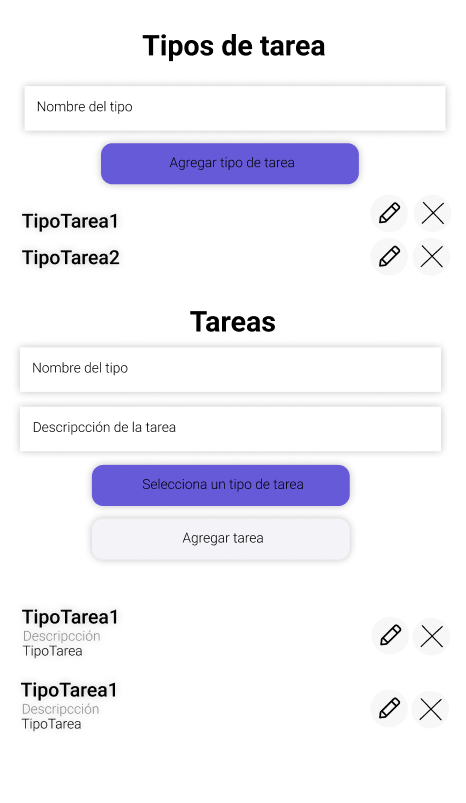
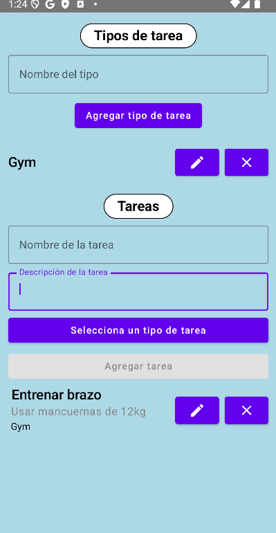

# 📝 Gestor de Tareas 

Bienvenido a la **Aplicación Gestor de Tareas** 🛠️.  

📋 **Descripción**  
En esta aplicación se muestra la interfaz de un gestor de tareas, que te permitirá gestionar tus tareas según su tipo, organizarte de forma sencilla y clara y mantener un control eficiente de tu productividad.  

## ✨ **Funcionalidades**  

### Gestión de Tipos de Tarea:  
- ➕ **Crear Tipo de Tarea**: Agrega nuevas categorías para organizar tus tareas.  
- ✏️ **Editar Tipo de Tarea**: Modifica los nombres de tus tipos de tarea existentes.  
- ❌ **Eliminar Tipo de Tarea**: Elimina categorías que ya no necesitas.  

### Gestión de Tareas:  
- ➕ **Crear Tarea**: Crea una nueva tarea asignándole un título, descripción y tipo.  
- ✏️ **Editar Tarea**: Actualiza el título y/o la descripción de una tarea existente.  
- ❌ **Eliminar Tarea**: Borra tareas completadas o que ya no sean relevantes.  

## 🖌️ **Boceto de la Interfaz**  

## ✨  **Diseño final**  

